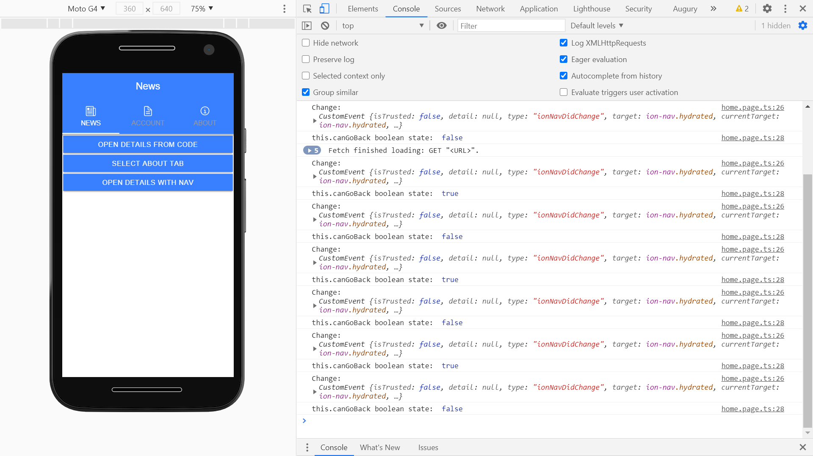

# :zap: Ionic Swipeable Tabs

Ionic-Angular tutorial app with swipeable tab navigation.

## :page_facing_up: Table of contents

* [General info](#general-info)
* [Screenshots](#screenshots)
* [Technologies](#technologies)
* [Setup](#setup)
* [Features](#features)
* [Status](#status)
* [Inspiration](#inspiration)
* [Contact](#contact)

## :books: General info

* User can swipe left or right to switch between News, Account and About tab pages. News page has 3 buttons that open News Details and About pages.

## :camera: Screenshots



## :signal_strength: Technologies

* [Ionic v5](https://ionicframework.com/)
* [Angular v8](https://angular.io/)
* [Ionic/angular v4](https://www.npmjs.com/package/@ionic/angular) including [ion-nav-link](https://ionicframework.com/docs/api/nav-link)
* [@ionic-super-tabs/angular v6](https://www.npmjs.com/package/@ionic-super-tabs/angular)

## :floppy_disk: Setup

* To start the server on _localhost://8100_ type: 'ionic serve'

## :computer: Code Examples

* sets `canGoBack` boolean variable to `true` when there is an Ionic navigation event.

```typescript
  ngAfterViewInit() {
    this.newsNav.ionNavDidChange.subscribe(async (event: any) => {
      console.log('Change: ', event)
      this.canGoBack = await this.newsNav.canGoBack();
    });
  }
```

## :cool: Features

* Home page has super-tabs navigation - app-routing module just navigates to home page. Individual page routing modules removed.

## :clipboard: Status & To-do list

* Status: Working

* To-do: nothing. Could use this swipeable menu in other Ionic apps.

## :clap: Inspiration

* [Simon Grimm, Ionic Academy Tutorial: Building a Swipeable Tabs Navigation with Ionic 4+](https://www.youtube.com/watch?v=8qUywCzR-vo&t=1s)
* [Ionic forum: Ionic Swipeable Tabs are now here!](https://forum.ionicframework.com/t/ionic-swipeable-tabs-are-now-here/84266)

## :envelope: Contact

* Repo created by [ABateman](https://www.andrewbateman.org) - you are welcome to [send me a message](https://andrewbateman.org/contact)
